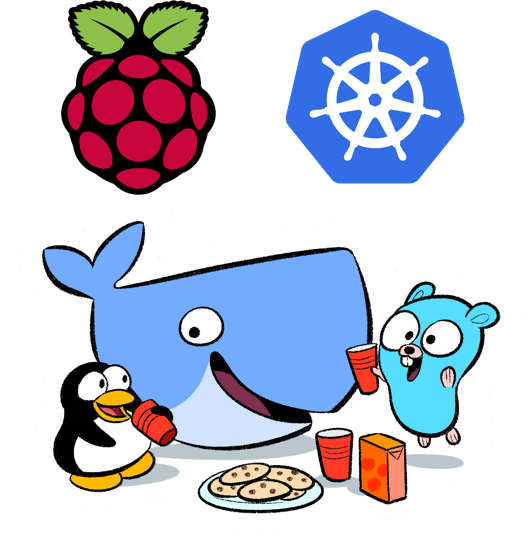

# Welcome to the Kubernetes on ARM project!

#### Kubernetes on a Raspberry Pi?
#### Is that possible?

#### Yes, now it is.    
Imagine... Your own testbed for Kubernetes with cheap Raspberry Pis. 



#### **Are you convinced too, like me, that cheap ARM boards and Kubernetes is a match made in heaven?**    
**Then, lets go!**

## Download and build a SD Card

The first thing you will do, is to create a SD Card for your Pi.
The only supported operating system at the moment is Arch Linux ARM.
The installer will write Arch Linux ARM to your SD Card, and include some Kubernetes scripts!

 - Step 1: Insert the SD Card into your computer
 - Step 2: Open a Linux command line, e. g. Ubuntu Terminal
   - Windows downloads coming soon...
 - Step 3: Install git in order to download this project, e. g. `sudo apt-get install git`
 - Step 4: Check which letter you SD Card has, similar to `/dev/sdb`
   - Run `sudo fdisk -l` to list all hard drives connected to the computer


```bash
# Go to our home folder (optional)
cd ~

# Download this project
git clone https://github.com/luxas/kubernetes-on-arm

# Change to that directory
cd kubernetes-on-arm

# Use latest stable version if you want
git checkout v0.5.6

# Get some help text about supported options
sdcard/write.sh

# Write the SD Card, replace X with the real letter
# Replace `rpi-2` with `rpi` if you have an Raspberry Pi 1.
# We're specifying that we want `archlinux` as operating system.
# We also want Kubernetes scripts in our new SD Card image so `kube-archlinux` should be there
sudo sdcard/write.sh /dev/sdX rpi-2 archlinux kube-archlinux

# The installer will ask you if you want to erase all data on your card
# Answer y/n on that question
# Prepend the command with QUIET=1 if no security check should be made
# Requires an internet connection
# This script runs in 3-4 mins
```

## Setup your board

Start your Raspberry Pi    
Log into it. The user/password is: **root/root** or **alarm/alarm**     
Yes, I know. Root enabled via ssh isn´t that good.
But for the moment the task to enhance ssh security is left as an exercise to the user.
These scripts requires root. So if you login via **alarm**, then `su root` when you´re going to do some serious hacking :)

```bash
# This script will install and setup docker etc.
kube-config install

# The script will ask you for timezone. Defaults to Europe/Helsinki
# Run "timedatectl list-timezones" before to check for values

# It will ask you if it should create a 1 GB swapfile.
# If you are gonna build Kubernetes on your own machine, you have to create this

# It will ask for which hostname you want. Defaults to kubepi.

# Last question is whether you want to reboot
# You must do this, otherwise docker will behave very strange and fail

# If you want to run this script non-interactively, do this:
# TIMEZONE=Europe/Helsinki SWAP=1 NEW_HOSTNAME=mynewpi REBOOT=0 kube-config install
# This script runs in 2-3 mins
```
Kubernetes should work on Raspberry Pi 1 (A, A+, B, B+), which is armv6, Raspberry Pi 2 (armv7).   
Right now there's an issue for `armv6`, so it isn't usable on a Pi 1 at the moment.    
Read about the Parallella board [here](docs/parallella-status.md) 
Experimental cubietruck support is also present.

## Build the Docker images for ARM

Everything have to be compiled to ARM. Fortunately this is possible with Go.     
We will be setting up Kubernetes in a Docker container, so we have to build some images.  

This step is now optional.    
Proceed to [Setup Kubernetes](#setup-kubernetes) if you want to download the images from Docker Hub.

```bash

# Build all master images
kube-config build-images

# Build all addons
kube-config build-addons

# This script will take approximately 45 min on a Raspberry Pi 2
# Grab yourself a coffee during the time!
```

The script will produce these Docker images:    
 - luxas/raspbian: Is a stripped `resin/rpi-raspbian` image. [Docs coming soon...]()
 - luxas/alpine: Is a Alpine Linux image. Only 8 MB. Based on `mini-containers/base`. [Docs coming soon...]()
 - luxas/go: Is a Golang image, which is used for building repositories on ARM. [Docs coming soon...]()
 - kubernetesonarm/build: This image downloads all source code and builds it for ARM. [Docs coming soon...]()

These images are used in the cluster:
 - kubernetesonarm/etcd: `etcd` is the data store for Kubernetes. Used only on master. [Docs](https://github.com/luxas/kubernetes-on-arm/blob/master/images/kubernetesonarm/etcd/README.md)
 - kubernetesonarm/flannel: `flannel` creates the Kubernetes overlay network. [Docs](https://github.com/luxas/kubernetes-on-arm/blob/master/images/kubernetesonarm/flannel/README.md)
 - kubernetesonarm/hyperkube: This is the core Kubernetes image. This one powers your Kubernetes cluster. [Docs](https://github.com/luxas/kubernetes-on-arm/blob/master/images/kubernetesonarm/hyperkube/README.md)
 - kubernetesonarm/pause: `pause` is a image Kubernetes uses internally. [Docs](https://github.com/luxas/kubernetes-on-arm/blob/master/images/kubernetesonarm/pause/README.md)


## Setup Kubernetes

```bash

# To enable the master service, run
kube-config enable-master

# To enable the worker service, run
kube-config enable-worker

# The "enable-worker" script will ask you for the ip of the master
# Write in the ip address and you´re done!
```


## Use Kubernetes

After you have built the images, `kubectl` will be available.

```bash

# Some examples

# Get info about your machine and Kubernetes version
kube-config info

# Make an replication controller with an image
# Hopefully you will have some minions, so you is able to see how they spread across hosts
# The nginx-test image will be downloaded from Docker Hub and is a nginx server which only is serving the message: "<p>WELCOME TO NGINX</p>"
kubectl run my-nginx --image=luxas/nginx-test --replicas=3

# See that the nginx container is running
docker ps

# See which pods are running
kubectl get pods

# See which nodes we have
kubectl get nodes

# Expose the replication controller "my-nginx" as a service
kubectl expose rc/my-nginx --port=80

# See which ip we may ping, by getting services
kubectl get svc

# See if the nginx container is working
# Replace $SERVICE_IP with the ip "kubectl get svc" returned 
curl $SERVICE_IP
# --> <p>WELCOME TO NGINX</p>

# Start dns
kube-config enable dns

# Maybe they landed on our node?
docker ps

# See which internal cluster services that are running
kubectl --namespace=kube-system get pods,rc,svc

# Test dns
curl my-nginx.default.svc.cluster.local
# --> <p>WELCOME TO NGINX</p>

# Start the registry
kube-config enable-addon registry

# Wait a minute for it to start
kubectl --namespace=kube-system get pods

# Tag an image
docker tag my-name/my-image registry.kube-system.svc.cluster.local:5000/my-name/my-image

# And push it to the registry
docker push registry.kube-system.svc.cluster.local:5000/my-name/my-image

# On another node, pull it
docker pull registry.kube-system.svc.cluster.local:5000/my-name/my-image

```

## Addons

Two addons is available right now (and one experimental)
 - Kubernetes DNS:
   - Every service gets the hostname: `{{my-svc}}.{{my-namespace}}.svc.cluster.local`
   - Example: `my-awesome-webserver.default.svc.cluster.local` may resolve to ip `10.0.0.154`
   - Those DNS names is available both in containers and on the node itself (by adding it to `/etc/resolv.conf`)
   - If you want to access the Kubernetes API easily, `curl -k https://kubernetes.kube-system.svc.cluster.local` or `curl -k https://10.0.0.1` if you remember numbers better.
   - The DNS server itself has allocated ip `10.0.0.10`
   - The DNS domain is for the moment `cluster.local`
 - Central image registry
   - A registry for storing cluster images if one loses the internet connection for example.
   - Or for cluster images that one not want to publish on Docker Hub
   - This service is available at this address: `registry.kube-system.svc.cluster.local` or at the `10.0.0.20` ip
   - Just tag your image: `docker tag my-name/my-image registry.kube-system.svc.cluster.local:5000/my-name/my-image`
   - And push it to the registry: `docker push registry.kube-system.svc.cluster.local:5000/my-name/my-image`
 - Kubernetes UI
   - An web frontend for mostly viewing the cluster status
   - [Official project](https://github.com/kubernetes/kube-ui)
   - `kube-ui` hasn't been released yet, so this is very experimental and going to change
   - It will not display some useful information right now, so use it only if you want to hack on it


## Service management

The `kube-archlinux` rootfs (the only one atm) uses systemd services for starting/stopping containers.

Systemd services: 
 - system-docker: Or `bootstrap-docker`. Used for running `etcd` and `flannel`.
 - etcd: Starts the `kubernetesonarm/etcd` container. Depends on `system-docker`.
 - flannel: Starts the `kubernetesonarm/flannel` container. Depends on `etcd`.
 - docker: Plain docker service. Dropins are symlinked. Depends on `flannel`.
 - k8s-master: Service that starts up the main master components
 - k8s-minion: Service that starts up `kubelet` and the `proxy`.


Useful commands for troubleshooting: 
 - `systemctl status (service)`: Get the status
 - `systemctl start (service)`: Start
 - `systemctl stop (service)`: Stop
 - `systemctl cat (service)`: See the `.service` files for an unit.
 - `journalctl -xe`: Get the system log
 - `journalctl -xeu (service)`: Get logs for a service

## Beta version

This project is under development.  
[Changelog](CHANGELOG.md)

## Known issues

When the service `k8s-master` is stopped by `systemctl`, the other master components (`apiserver`, `controller-manager`, `scheduler`) in their containers, isn´t stopped.

After a reboot, the `etcd` service doesn´t work properly. But I´m working on it.

## Future work

 - Compile [RancherOS](https://github.com/rancher/os) to ARM
 - Add support for Banana Pro
 - Add support for Kubernetes Web UI
 - Add support for [HypriotOS](http://blog.hypriot.com)?
 - More security with (self-signed or real) certificates and service accounts

And lots of other interesting things...

## Goals for this project

This project ports [Kubernetes](https://github.com/kubernetes/kubernetes) to the ARM architecture. 
The primary boards used for testing is Raspberry Pi 2´s.

My goal for this project is that it should be as small as possible, while retaining its flexibility.  
It should also be as easy as possible for people, who don´t know anything about Kubernetes, to get started.

It should be easy in the future to add support for new boards and operating systems.

#### Feel free to create an issue if you find a bug or think that something should be added or removed!